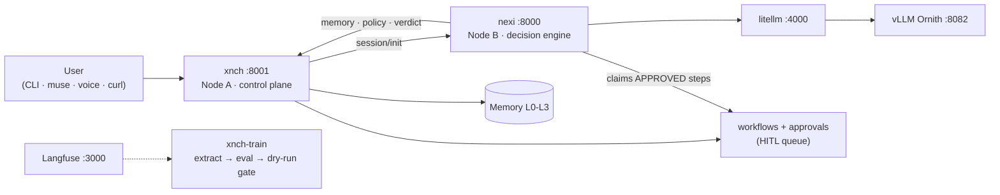

# xnchSystems

Private AI orchestration platform: an agent that perceives, remembers, decides
under explicit policy governance, acts through human-approved workflows, and
learns from outcomes — solo-built, running entirely on two owned physical
machines under a **no-k3s systemd regime**. No cloud dependency for inference.

- **xnch** (`xnch/` submodule) — control plane: REST API (:8001), authN/Z,
  policy engine, memory tiers, goals, HITL verdict path, audit ledger, learning.
- **nexi** (`nexi/` submodule) — decision engine (:8000): 10-step pipeline,
  character/persona, goal driver, workflow executor.

Two FastAPI services (Python 3.13+), a Next.js app (`web/`), the `xnch-train`
eval pipeline, an MCP bridge (`xnch_mcp/`), and infra automation under
`infra/no-k3s/`.

## Two-minute architecture



**Nodes** ([details](docs/architecture/topology.md)):

| | Node A — `gate7` (192.168.50.1) | Node B — `xnch-core` (192.168.50.2) |
|---|---|---|
| Runtime | Docker Compose + systemd | bare venv + systemd (no Docker) |
| Runs | postgres-pgvector :5432 · redis :6379 · litellm :4000 · langfuse :3000 (+pg :5433) · searxng :8888 (loopback) · **xnch** :8001 · consolidation timer · tailscale funnel | **vllm-ornith** :8082 · **nexi** :8000 · exec-agent :8004 · fs-read-agent :8003 |
| Notes | always on; WoL-wakes Node B | RTX 3090 sleeps when idle |

## Repository layout

```
xnch/            submodule → github.com/x-nch/xnch   (control plane)
nexi/            submodule → github.com/x-nch/nexi   (decision engine)
web/             muse — Next.js UI: approvals queue, workflow builder,
                 chat/memory/graph views; /api/gateway proxy to xnch
xnch-train/      training data pipeline + eval harness (Phase 0: dry-run gate)
xnch_mcp/        MCP server + federated bridge (native xnch_* tools, crg_/am_/doc_)
cli/             Typer CLI client incl. voice loop (Mac client targets gate7)
exec_agent/      Node B governed command runner (:8004)
fs_read_agent/   Node B read-only file agent (:8003)
scraper/         tiered web scraper service
docs_test_mcp/   offline docs MCP server
infra/no-k3s/    CURRENT deploy regime: compose, systemd units, boot scripts,
                 e2e-test.sh, policy/config templates  (MIGRATION.md documents
                 the k3s → direct migration + rollback)
infra/k8s/       LEGACY k3s manifests — retired, kept for rollback history only
scripts/         helper scripts (voice setup, deploy, audits)
tests/           cross-service e2e suite
docs/            this documentation tree (start at docs/index.md)
misc/            historical notes/handoffs (not operating docs)
```

## Quickstart

Development first ([full guide](docs/guides/quickstart-dev.md)):

```bash
git clone https://github.com/x-nch/xnchSystems && cd xnchSystems
git submodule update --init --recursive
uv sync --all-groups          # Python 3.13+; see docs/reference/tests.md for fresh-env caveats
uv run python -m xnch.main    # control plane :8001 (needs Redis; Postgres for L2)
uv run python -m nexi.main    # engine :8000
pytest                        # tests (asyncio auto); see docs/reference/tests.md
```

Production bring-up:

```bash
# Node A
cd ~/xnchSystems/infra/no-k3s/node-a && ./start-node-a.sh --wake-node-b --wait-node-b
# Node B (or automatically woken above)
cd ~/xnchSystems/infra/no-k3s/node-b && ./start-node-b.sh --install
# back on Node A
cd ~/xnchSystems/infra/no-k3s && ./e2e-test.sh
```

Env files live at `~/.xnch/xnch.env` (A) and `~/.xnch/nexi.env` (B); templates
in `infra/no-k3s/shared/.env.example`. Exhaustive variable reference:
[docs/reference/env-vars.md](docs/reference/env-vars.md).

## Documentation

| I want to… | Go to |
|---|---|
| understand the system | [docs/architecture/overview](docs/architecture/overview.md) |
| deploy / restart nodes | [guides/deploy-node-a](docs/guides/deploy-node-a.md) · [runbooks](docs/runbooks/restart-node-a.md) |
| approve gated actions | [guides/operate-hitl](docs/guides/operate-hitl.md) |
| automate multi-step work | [guides/build-workflow](docs/guides/build-workflow.md) · [architecture/workflows-hitl](docs/architecture/workflows-hitl.md) |
| look up an API/env var/CLI | [docs/reference/](docs/reference/index.md) |
| run eval baselines | [guides/run-eval](docs/guides/run-eval.md) |
| use voice | [guides/voice](docs/guides/voice.md) |
| handle GPU contention | [runbooks/gpu-window](docs/runbooks/gpu-window.md) |

Decision records (immutable): [`docs/adr/`](docs/adr/) ·
[`docs/superpowers/`](docs/superpowers/).

> Where code and docs disagree, code wins — please flag the page.
