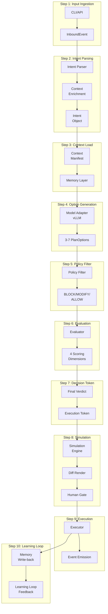

```mermaid
flowchart TB
    subgraph INPUT["Step 1: Input Ingestion"]
        CLI["CLI/API"]
        Inbound["InboundEvent"]
    end

    subgraph PARSING["Step 2: Intent Parsing"]
        IP["Intent Parser"]
        Context["Context<br/>Enrichment"]
        Intent["Intent<br/>Object"]
    end

    subgraph NEXI_PREP["Step 3: Context Load"]
        Manifest["Context<br/>Manifest"]
        Memory["Memory Layer"]
    end

    subgraph NEXI_GEN["Step 4: Option Generation"]
        Model["Model Adapter<br/>vLLM"]
        Options["3-7 PlanOptions"]
    end

    subgraph NEXI_FILTER["Step 5: Policy Filter"]
        Filter["Policy Filter"]
        Result1["BLOCK/MODIFY/<br/>ALLOW"]
    end

    subgraph NEXI_EVAL["Step 6: Evaluation"]
        Evaluator["Evaluator"]
        Scores["4 Scoring<br/>Dimensions"]
    end

    subgraph CONTROL_DECIDE["Step 7: Decision Token"]
        Verdict["Final Verdict"]
        Token["Execution Token"]
    end

    subgraph CONTROL_SIM["Step 8: Simulation"]
        Sim["Simulation<br/>Engine"]
        Diff["Diff Render"]
        Human["Human Gate"]
    end

    subgraph CONTROL_EXEC["Step 9: Execution"]
        Executor["Executor"]
        Ledger["Event Emission"]
    end

    subgraph LEARNING["Step 10: Learning Loop"]
        WriteBack["Memory<br/>Write-back"]
        Feedback["Learning Loop<br/>Feedback"]
    end

    %% Connections
    CLI --> Inbound
    Inbound --> IP
    IP --> Context
    Context --> Intent

    Intent --> Manifest
    Manifest --> Memory

    Memory --> Model
    Model --> Options

    Options --> Filter
    Filter --> Result1

    Result1 --> Evaluator
    Evaluator --> Scores

    Scores --> Verdict
    Verdict --> Token

    Token --> Sim
    Sim --> Diff
    Diff --> Human

    Human --> Executor
    Executor --> Ledger

    Executor --> WriteBack
    WriteBack --> Feedback
```