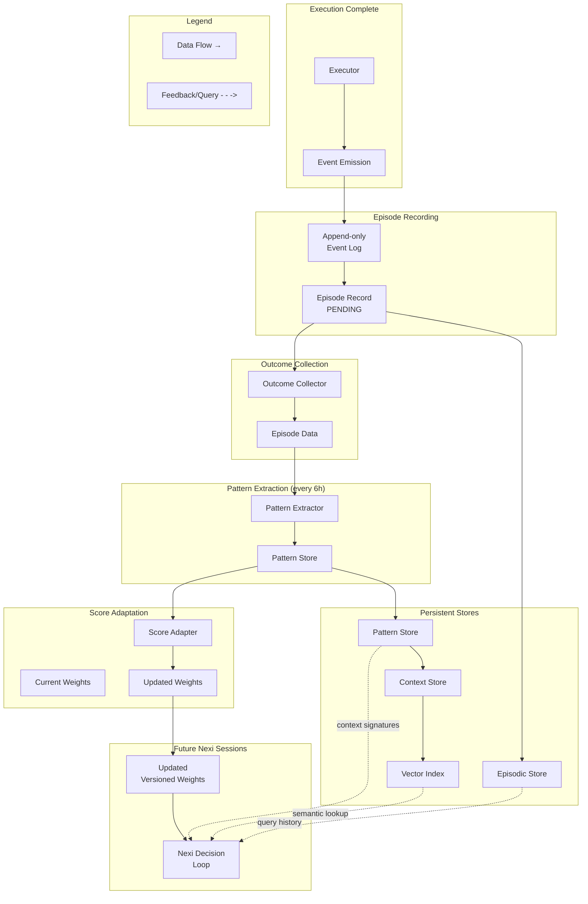

```mermaid
flowchart TB
    subgraph EXECUTION["Execution Complete"]
        EX["Executor"]
        Event["Event Emission"]
    end

    subgraph EPISODE_RECORD["Episode Recording"]
        EL["Append-only<br/>Event Log"]
        ER["Episode Record<br/>PENDING"]
    end

    subgraph OUTCOME_COLLECT["Outcome Collection"]
        OC["Outcome Collector"]
        Episode["Episode Data"]
    end

    subgraph PATTERN_EXTRACT["Pattern Extraction (every 6h)"]
        PE["Pattern Extractor"]
        Patterns["Pattern Store"]
    end

    subgraph SCORE_ADAPT["Score Adaptation"]
        SA["Score Adapter"]
        OldWeights["Current Weights"]
        NewWeights["Updated Weights"]
    end

    subgraph NEXI_UPDATED["Future Nexi Sessions"]
        FutureNexi["Nexi Decision<br/>Loop"]
        UpdatedWeights["Updated<br/>Versioned Weights"]
    end

    subgraph STORES["Persistent Stores"]
        Episodic["Episodic Store"]
        Pattern["Pattern Store"]
        Context["Context Store"]
        Vector["Vector Index"]
    end

    %% Main flow
    EX --> Event
    Event --> EL
    EL --> ER

    ER --> OC
    OC --> Episode

    Episode --> PE
    PE --> Patterns

    Patterns --> SA
    SA --> NewWeights

    NewWeights --> UpdatedWeights

    UpdatedWeights --> FutureNexi

    %% Store connections
    ER --> Episodic
    Episodic -.->|"query history"| FutureNexi
    Patterns --> Pattern
    Pattern -.->|"context signatures"| FutureNexi
    Pattern --> Context
    Context --> Vector
    Vector -.->|"semantic lookup"| FutureNexi

    %% Legend
    subgraph LEGEND["Legend"]
        L1["Data Flow →"]
        L2["Feedback/Query - - ->"]
    end
```