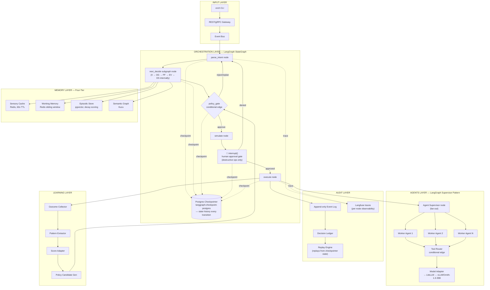

# xnchSystems Architecture — Post-LangGraph Integration

## What changed vs. the original design

| Layer | Before | After LangGraph |
|---|---|---|
| Control | Custom sequential Intent Parser → Policy Gate → Sim Engine → Executor | `StateGraph` with typed state, conditional edges, `interrupt()` gates |
| Nexi | Parallel 5-stage pipeline (II→OG→PF→EV→DS) | Single subgraph node invoked by the orchestrator, same internal stages |
| Agents | Registry + Supervisor + Router (custom) | LangGraph supervisor pattern — fan-out to worker agent nodes |
| Persistence | Ad hoc, mostly Audit Layer only | `langgraph-checkpoint-postgres` checkpoints *every* state transition |
| Human gate | Implicit / app-level rule ("no auto kubectl apply") | Explicit `interrupt()` node before Executor on destructive ops |
| Memory | SQLite + Chroma + Redis KV cache | Redis sensory cache (60s TTL) → Redis working memory → pgvector episodic → Kuzu semantic graph |
| Observability | Audit log only | Langfuse traces on every node execution (LangSmith explicitly excluded — local-only constraint) |

## Diagram

## Interview talking points this diagram supports

1. **Why LangGraph over a custom orchestrator** — you already had a working hand-rolled Control Layer. The judgment call was: checkpointing, replay, and interrupt semantics are hard to get right and easy to get subtly wrong under failure; LangGraph gives you that for free while you keep full control of node logic. Good "build vs. adopt" story for FDE interviews.

2. **Checkpointer as durability, not just logging** — Postgres checkpoints mean a crashed run resumes from its last node, not from zero. Ties directly into your payments background: idempotency and exactly-once-ish semantics under partial failure is the same problem you solved with Kafka consumer offsets at Rakuten.

3. **`interrupt()` as the enforcement point for your no-auto-apply rule** — this is a stronger story than "we have a rule" — it's "the rule is structurally unbypassable because the graph literally cannot reach the execute node without a human resuming it." Concrete answer to "how do you prevent an agent from doing something destructive."

4. **Supervisor pattern in the Agents layer** — fan-out/fan-in with a router is the standard answer to "how would you architect a multi-agent system," and you can point at a running implementation instead of whiteboard theory.

5. **LangSmith exclusion** — good answer to "how do you handle observability without vendor lock-in / with a local-only constraint." Langfuse self-hosted + Postgres checkpoints as the audit trail is a defensible substitute.

6. **Known gaps, stated plainly** — Kuzu not fully wired into the write path, `PgEpisodicStore.connect()` still a stub. Naming these unprompted in an interview reads as engineering maturity, not weakness — you know exactly where the system is incomplete and why.
