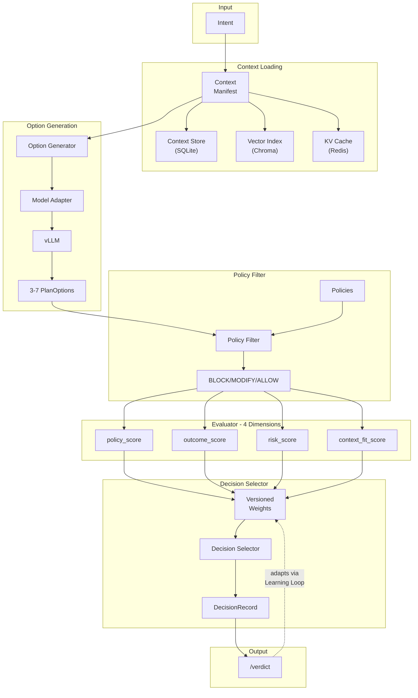

```mermaid
flowchart TB
    subgraph INPUT["Input"]
        Intent["Intent"]
    end

    subgraph CONTEXT["Context Loading"]
        Manifest["Context<br/>Manifest"]
        CS["Context Store<br/>(SQLite)"]
        VI["Vector Index<br/>(Chroma)"]
        KC["KV Cache<br/>(Redis)"]
    end

    subgraph GENERATE["Option Generation"]
        OG["Option Generator"]
        MA["Model Adapter"]
        vLLM["vLLM"]
        Options["3-7 PlanOptions"]
    end

    subgraph FILTER["Policy Filter"]
        PF["Policy Filter"]
        Policies["Policies"]
        Results["BLOCK/MODIFY/ALLOW"]
    end

    subgraph EVALUATE["Evaluator - 4 Dimensions"]
        policy["policy_score"]
        outcome["outcome_score"]
        risk["risk_score"]
        context["context_fit_score"]
    end

    subgraph SELECT["Decision Selector"]
        Weights["Versioned<br/>Weights"]
        Selector["Decision Selector"]
        Decision["DecisionRecord"]
    end

    subgraph OUTPUT["Output"]
        Verdict["/verdict"]
    end

    %% Connections
    Intent --> Manifest

    Manifest --> CS
    Manifest --> VI
    Manifest --> KC

    Manifest --> OG
    OG --> MA
    MA --> vLLM
    vLLM --> Options

    Options --> PF
    Policies --> PF
    PF --> Results

    Results --> policy
    Results --> outcome
    Results --> risk
    Results --> context

    policy --> Weights
    outcome --> Weights
    risk --> Weights
    context --> Weights

    Weights --> Selector
    Selector --> Decision

    Decision --> Verdict

    %% Feedback loop to weights
    Verdict -.->|"adapts via<br/>Learning Loop"| Weights
```