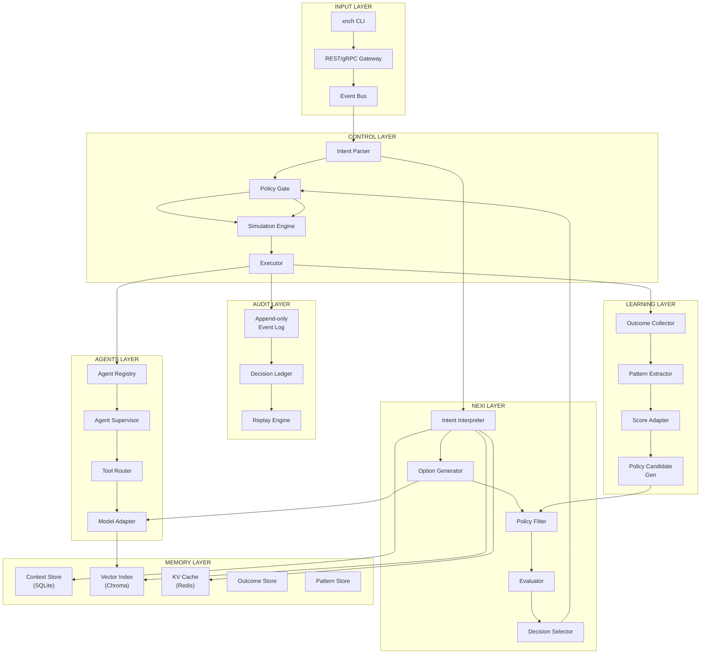

```mermaid
flowchart TB
    subgraph INPUT["INPUT LAYER"]
        CLI["xnch CLI"]
        GW["REST/gRPC Gateway"]
        EB["Event Bus"]
    end

    subgraph CONTROL["CONTROL LAYER"]
        IP["Intent Parser"]
        PG["Policy Gate"]
        SE["Simulation Engine"]
        EX["Executor"]
    end

    subgraph NEXI["NEXI LAYER"]
        II["Intent Interpreter"]
        OG["Option Generator"]
        PF["Policy Filter"]
        EV["Evaluator"]
        DS["Decision Selector"]
    end

    subgraph AGENTS["AGENTS LAYER"]
        AR["Agent Registry"]
        AS["Agent Supervisor"]
        TR["Tool Router"]
        MA["Model Adapter"]
    end

    subgraph MEMORY["MEMORY LAYER"]
        CS["Context Store<br/>(SQLite)"]
        VI["Vector Index<br/>(Chroma)"]
        KC["KV Cache<br/>(Redis)"]
        OS["Outcome Store"]
        PS["Pattern Store"]
    end

    subgraph AUDIT["AUDIT LAYER"]
        EL["Append-only<br/>Event Log"]
        DL["Decision Ledger"]
        RE["Replay Engine"]
    end

    subgraph LEARNING["LEARNING LAYER"]
        OC["Outcome Collector"]
        PE["Pattern Extractor"]
        SA["Score Adapter"]
        PC["Policy Candidate<br/>Gen"]
    end

    %% Inter-layer connections
    CLI --> GW
    GW --> EB
    EB --> IP

    IP --> PG
    PG --> SE
    SE --> EX

    IP --> II
    II --> OG
    OG --> MA
    MA --> VI
    OG --> PF
    PF --> EV
    EV --> DS

    DS --> PG
    PG --> SE

    EX --> AR
    AR --> AS
    AS --> TR
    TR --> MA

    II --> CS
    II --> VI
    II --> KC

    EX --> EL
    EL --> DL
    DL --> RE

    EX --> OC
    OC --> PE
    PE --> SA
    SA --> PC
    PC --> PF
```