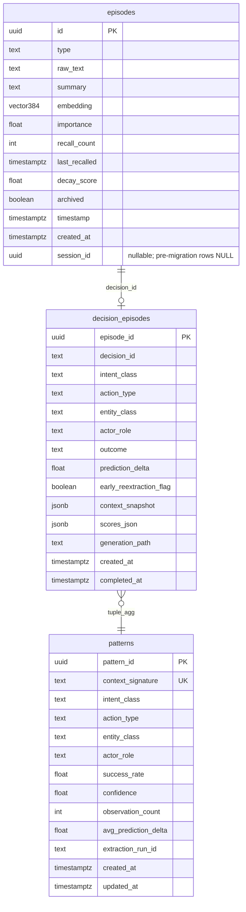
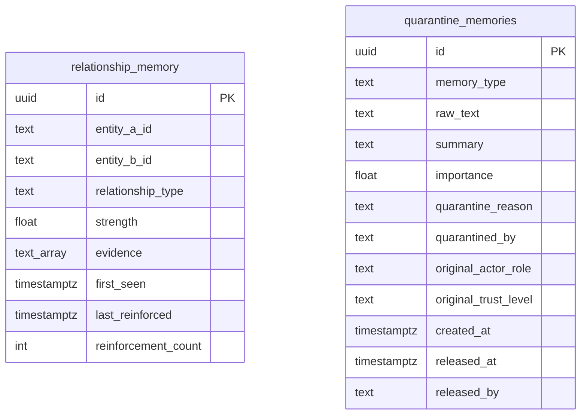

# Data Model

Audience: devs. Sources: `xnch/memory/pg_episodic_store.py`,
`relationship_store.py`, `quarantine_store.py`, `pattern_store.py`,
`graph_store.py`, `goal_store.py`, `workflow_store.py`; diagram suite §6
(authoritative ERDs reproduced here).

Eight-plus tables across Postgres, Kuzu, SQLite, Redis.

## Postgres — episodic core (pgvector)

## Postgres — relationships & quarantine

## Kuzu — semantic graph

File: `~/.xnch/graph.kuzu`. `entities(entity_id PK, name, type, created_at)`
connected by typed `relations(rel_type, confidence, created_at)`.
Written by consolidation's graph extractor; read by chat assembly for entity
context.

## SQLite — governance stores

| DB/file | Tables | Owner |
|---|---|---|
| `~/.xnch/data/episodic.db` | sqlite_episodes (verdict-path mirror incl. schema_version) | EpisodicStore |
| pattern store (SQLite) | patterns cache | PatternStore |
| goal store (SQLite) | goals + leases (`claim_next_goal`) | GoalStore |
| workflow store (SQLite) | workflows, steps (status/lease_owner/lease_expires_at/payload_json/max_retries), runs, approvals (producer_type/producer_id/status/snapshot_json) | WorkflowStore |

Workflow step states: see [workflows & HITL](workflows-hitl.md).

## Redis keyspace

L0 sensory entries (~60 s TTL), L1 working-memory sessions×turns, KV cache,
session dedup, rate limiting, intent recall cache.

## Cross-store links

Consolidation flows episodes → relationship_memory → mirrored into Kuzu;
the verdict path mirrors decision tuples into SQLite while PG holds the
canonical decision_episodes row.
