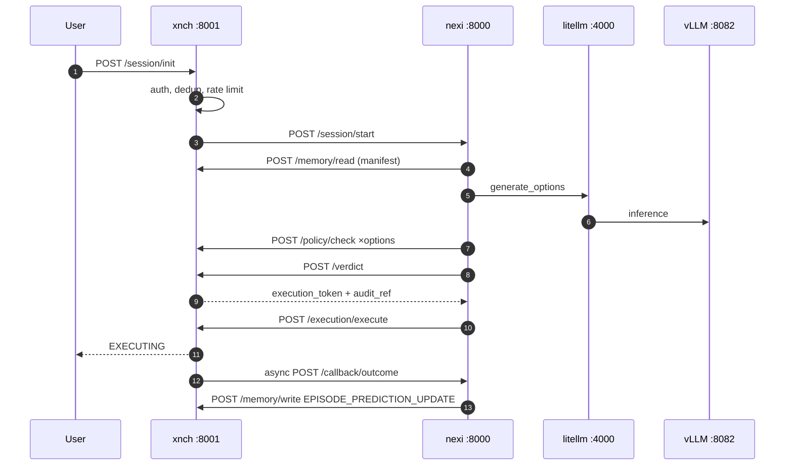

# Decision Pipeline & Verdict (HITL) Path

Audience: devs. Sources: `nexi/pipeline/`, `nexi/main.py`,
`xnch/routes/{session,verdict,execution,policy}.py`,
[diagram suite §4/§7/§8](../architecture-suite.md).

## The ten steps (`POST /session/start` on nexi :8000)

1. **IntentInterpreter** — rules + Redis recall cache, LLM fallback
   (`NEXI_INTENT_CLASSIFIER_MODEL`).
2. **load_context** — nexi → xnch `POST /memory/read` for a ContextManifest
   (episodes, patterns, policy refs).
3. **generate_options** — ModelAdapter via LiteLLM/vLLM Ornith,
   `NEXI_OPTIONS_COUNT` options.
4. **PolicyFilter** — nexi → xnch `POST /policy/check` per option.
5. **Evaluator** — scoring + simulation.
6. **select_decision** — best surviving option.
7. **compile_action_spec** — typed action spec.
8. **submit_verdict** — nexi → xnch `POST /verdict` (authoritative re-eval).
9. **dispatch_execution** — nexi → xnch `POST /execution/execute`
   (`NEXI_EXECUTION_RUNNER_URL`); execution token required.
10. **return EXECUTING** — session response; outcome arrives asynchronously.

## Verdict path = the HITL gate

`POST /verdict` is authoritative: xnch re-evaluates the chosen action through
the policy engine regardless of what nexi decided locally. Outcomes:
**ALLOW** (issue RS256 execution token, open decision episode), **BLOCK**
(ledger only). Human approval rides this same propose → interrupt → decide
path — see [workflows & HITL](workflows-hitl.md).

Execution tokens: RS256, 2048-bit keypair under `~/.xnch/keys/`, jti replay
protection, TTL `XNCH_TOKEN_TTL_MS`; enforced by xnch on `/execution/*` (nexi
forwards the token; it holds no JWT-decode path today). Full model:
[auth reference](../reference/auth-model.md).

## Outcome writeback

Runner reports `SUCCESS | PARTIAL | FAILURE` to `POST /execution/outcome` →
episodes completed in SQLite + PG → xnch calls nexi `POST /callback/outcome`
→ nexi computes `prediction_delta` → `POST /memory/write
EPISODE_PREDICTION_UPDATE` → early re-extraction of patterns when flagged.

## Variants

- **LangGraph pipeline** (optional): `XNCH_LANGGRAPH_PIPELINE=true` exposes
  `/governance/pipeline/invoke|resume|{thread_id}` with HITL interrupts;
  interrupt mode/risk threshold via `XNCH_HITL_EXECUTION_MODE`,
  `XNCH_HITL_RISK_THRESHOLD`.
- **Chat tool-loop** (default conversational surface): `/v1/chat/completions`
  and `/nexi/chat(+ /stream)` bypass the plan pipeline; they run recall +
  LiteLLM + MCP tools. See [chat & tools guide](../guides/chat-and-tools.md).
- **Goal driver**: autonomous loop claiming goals — `NEXI_GOAL_DRIVER_ENABLED`
  (off by default). See [goals API](../reference/api-xnch.md#goals).
