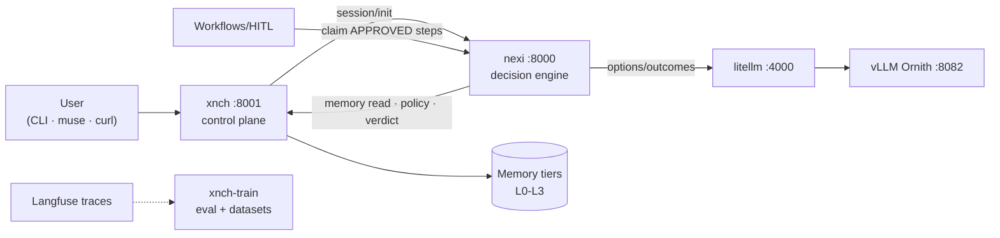

# System Overview

Audience: everyone. Sources: code graph (527 files / 3.2k nodes),
[diagram suite §1](../architecture-suite.md), package entrypoints
(`xnch/main.py`, `nexi/main.py`, `web/src/app`, `xnch-train/xnch_train/cli.py`).

xnchSystems is a local-first AI orchestration platform: an agent that perceives,
remembers, decides under explicit policy governance, acts on real systems through
human-approved workflows, and improves from recorded outcomes — running entirely
on two owned physical machines ([topology](topology.md)).

## Subsystems

| Subsystem | Where | What it does |
|---|---|---|
| **xnch control plane** | Node A, :8001 (`xnch/` submodule) | REST API, authN/Z, policy engine, memory tiers L0–L3, goals, verdict/HITL path, audit ledger, learning loop, consolidation |
| **nexi decision engine** | Node B, :8000 (`nexi/` submodule) | 10-step decision pipeline, character/persona, proactivity, goal driver, workflow executor |
| **Workflows + HITL** | xnch API + muse UI | workflow definitions/runs/steps, unified approvals queue, claim-lease executor |
| **xnch-train** | any (datasets on Node A FS) | extract→scrub→dataset→eval harness→dry-run promotion gate |
| **muse web app** | `web/` (Next.js, runs on the operator's Mac) | approvals queue, workflow builder, chat/memory/graph/system views, gateway proxy |
| **infra** | `infra/no-k3s/` | two-node systemd/compose regime, LiteLLM routing, Langfuse, SearXNG |

Supporting packages: `cli/` (voice-capable CLI client), `xnch_mcp/` (MCP bridge +
native tool server), `exec_agent/` + `fs_read_agent/` (Node B side-effect/read
agents), `scraper/`, `docs_test_mcp/`, root `tests/` e2e suite.

## One-minute dataflow

Deeper flows:

- Decision path & verdict gate → [decision-pipeline](decision-pipeline.md)
- Memory tiers, consolidation, learning → [memory](memory.md)
- Workflows, approvals, executor leases → [workflows-hitl](workflows-hitl.md)
- Schema across PG/Kuzu/SQLite → [data-model](data-model.md)
- Training pipeline & gates → [training](training.md)
- MCP bridge & tool tiers → [mcp-bridge](mcp-bridge.md)
- Nodes, ports, boot order → [topology](topology.md)

## Design principles (observed in code, restated)

1. **Governed autonomy** — nothing executes without a verdict; humans approve
   gated actions via the same propose→interrupt→decide path.
2. **Local-first** — inference on own GPU (Ornith); cloud escape hatch exists
   but is never default.
3. **Fail-open memory, fail-closed authority** — stores may be unavailable;
   policy/verdict decisions may not be skipped.
4. **Audit everything** — append-only event log + SHA-256-chained decision ledger.
5. **HITL before weight changes** — checkpoint promotion requires approval
   ([training ADR](../adr/2026-08-22-training-subsystem.md)).
