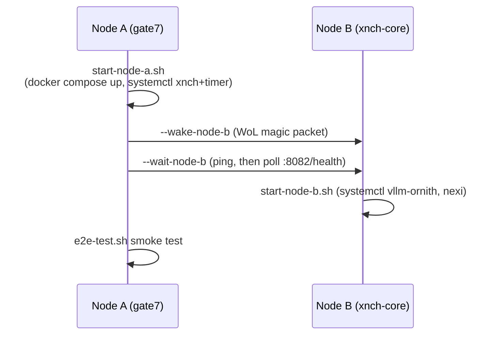

# Node Topology & Infrastructure

Audience: ops/dev. Sources: `infra/no-k3s/**` (compose, units, scripts),
[diagram suite](../architecture-suite.md) §2, `infra/no-k3s/MIGRATION.md`.

The platform runs on two physical nodes under a **no-k3s regime**: Docker
Compose + systemd on Node A, bare venv + systemd on Node B. The legacy k3s
cluster is retired (`infra/k8s/` remains only as historical reference;
rollback procedure lives in [MIGRATION.md](../../infra/no-k3s/MIGRATION.md)).

## Nodes

| | Node A | Node B |
|---|---|---|
| Hostname | `gate7` (alias `i7-node`) | `xnch-core` (alias `i9-node`) |
| Direct-link IP | `192.168.50.1` | `192.168.50.2` |
| Hardware | Intel i7 + GTX 1650 | Intel i9 + RTX 3090 (24 GiB) |
| Role | Control plane, memory, observability | Inference + decision engine |
| Runtime | Docker Compose + systemd | bare venv + systemd (no Docker) |
| Power | always on | sleeps when idle; WoL-wakeable from Node A |

**Network planes:** the `192.168.50.0/24` link is node-to-node. Operator LAN is
a separate home subnet (e.g. `192.168.1.x`) — clients such as the Mac voice CLI
target gate7's *home-LAN* address for xnch :8001, not `50.1`. The muse gateway
proxy defaults to the home-LAN address (`http://192.168.1.10:8001`), overridable
via `XNCH_GATEWAY_URL`. Remote access additionally exists via a Tailscale funnel
unit on Node A (`tailscale-funnel-xnch.service`, requires `tailscaled` + xnch).

## Node A services (docker compose — `infra/no-k3s/node-a/docker-compose.yml`)

| Service | Image | Port | Purpose |
|---|---|---|---|
| litellm | `ghcr.io/berriai/litellm:main-latest` | 4000 | Model routing gateway → vLLM Ornith on Node B (`shared/litellm-routing.yaml`) |
| langfuse | `langfuse/langfuse:2` (pinned v2, Postgres-only) | 3000 | LLM tracing; own DB below |
| postgres-pgvector | `pgvector/pgvector:pg16` | 5432 | L2 episodic, relationship, quarantine stores |
| langfuse-postgres | `pgvector/pgvector:pg16` | 5433 | Langfuse's own database |
| redis | `redis:7-alpine` | 6379 | L0 sensory, L1 working, KV cache, dedup |
| searxng | `searxng/searxng:latest` | 8888 (loopback only) | Anonymous web search for agents |

Network: `xnch-net`; volumes: `redis-data`, `pgdata`, `langfuse-pgdata`.

## Node A systemd units (`infra/no-k3s/node-a/systemd/`)

| Unit | Status | Notes |
|---|---|---|
| `xnch.service` | active | uvicorn xnch :8001; `After=/Wants= docker.service` |
| `consolidation.service` + `.timer` | active | daily consolidation → `POST /admin/consolidate`; orders after xnch |
| `tailscale-funnel-xnch.service` | as configured | `Requires= tailscaled xnch` |
| `perception.service` | DEFERRED/broken | no HTTP entrypoint exists in `xnch/perception/`; do not enable |
| `vault-indexer.service` | DEFERRED/broken | references non-existent `index_vault()`; do not enable |

## Node B systemd units (`infra/no-k3s/node-b/systemd/`)

| Unit | Port | Ordering | Notes |
|---|---|---|---|
| `nvidia-ready.service` | — | boots early | waits for NVIDIA driver |
| `vllm-ornith.service` | 8082 | `After=/Wants= network-online nvidia-ready` | serves `ornith-gptq-pro` (`ornith-1.0-35b`, GPTQ `gptq_marlin`, `VLLM_ATTENTION_BACKEND=FLASH_ATTN`, max-model-len 32768, max-num-seqs 2). GPU (~22 GiB) must be idle before start |
| `nexi.service` | 8000 | after network | `uvicorn nexi.main:app --port 8000`; `PYTHONPATH` includes both `nexi/` and `xnch/` dirs; env from `~/.xnch/nexi.env` |
| `exec-agent.service` | 8004 | after network | governed command runner; `XNCH_EXEC_LOCAL_HOST=node-b` |
| `fs-read-agent.service` | 8003 | after network | read-only file agent; `XNCH_FS_LOCAL_HOST=node-b` |

> **GPU exclusivity:** in-repo units coordinate via ordering dependencies only —
> there is no `Conflicts=` group in this tree. The training ADR describes a
> `Conflicts=` exclusivity regime (Ornith vs Vision Media Stack vs future train
> jobs) as target-state intent. Until that lands, GPU handoff is a manual
> protocol: see [runbooks/gpu-window](../runbooks/gpu-window.md).

## Boot order

Scripts: `start-node-a.sh` (`--install --skip-docker --wake-node-b
--wait-node-b --no-litellm-restart`), `start-node-b.sh` (`--install
--skip-vllm --no-wait-node-a`), `wake-node-b.sh` (WoL + 180 s ping wait),
`setup-gpu-driver.sh` (one-time driver install), `e2e-test.sh` (smoke test;
needs an `operator` actor + `XNCH_AUTH_SECRET`). See
[deploy guides](../guides/deploy-node-a.md) and
[restart runbooks](../runbooks/restart-node-a.md).

## Environment files

| File | Node | Feeds |
|---|---|---|
| `~/.xnch/xnch.env` | A | xnch service (template: `shared/.env.example`) |
| `~/.xnch/nexi.env` | B | nexi + exec/fs agents; carries cross-node URLs (Node A IPs) |

Full variable reference: [env-vars](../reference/env-vars.md).
