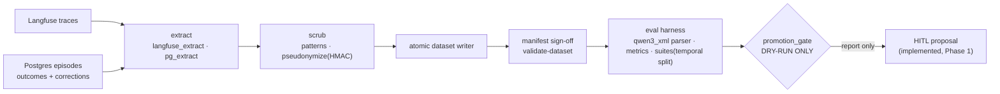

# Training Subsystem (`xnch-train`)

Audience: devs/operators of eval+data pipelines. Sources: `xnch-train/**`,
[ADR: training subsystem](../adr/2026-08-22-training-subsystem.md) (immutable
design record), [Phase 0 plan](../superpowers/plans/2026-08-22-training-subsystem-phase0.md).
Package README: [`xnch-train/README.md`](../../xnch-train/README.md).

`xnch-train` turns recorded system signal into evaluated training datasets —
Phase 0 (shipped): extraction, scrubbing, dataset authoring, eval harness, and
a **dry-run promotion gate**. Phase 1 (implemented 2026-08-27) adds the QLoRA
Train → Merge → Register → Propose cycle (see below). Nothing is promoted
without human approval through the standard HITL path.

## Pipeline



Stages (packages under `xnch-train/xnch_train/`):

| Stage | Modules | Notes |
|---|---|---|
| Extract | `extract/langfuse_extract.py`, `extract/pg_extract.py` | paginated Langfuse SDK fetches; SQL extracts keyed on `decision_id`; schema probe; guards non-object traces |
| Scrub | `scrub/patterns.py`, `scrub/pseudonymize.py`, `scrub/scrubber.py` | overlap-safe right-to-left scrubbing with aligned counters; deterministic HMAC pseudonymization keyed by `XTRAIN_PSEUDONYMIZE_SECRET` (**required**, fail-fast when empty) |
| Dataset | `extract/dataset_writer.py`, `models/{records,manifest}.py` | atomic writes; strict block validity; word-boundary persona markers; manifest sign-off verification |
| Eval harness | `evalharness/{client,qwen3xml,metrics,suites,runner}.py` | pinned request shape; robust tool-call reassembly; five gate metrics; versioned suites with temporal split; baseline runner |
| Gate | `gate/promotion_gate.py` | **dry-run**: computes metrics vs `XTRAIN_GATE_EPSILON` (0.02) and serving regression bound (10%); produces a report, changes nothing |

## CLI

```bash
cd xnch-train
uv run xtrain validate-dataset <dir>    # manifest gate; exit 0/1  [VERIFIED app loads]
uv run xtrain extract --out <dir> [--pg-dsn DSN] [--skip-langfuse]
uv run xtrain suite --out <file> [--cutoff ISO-DATE]
uv run xtrain baseline --base-url URL --model ID --suite FILE --out FILE \
    [--checkpoint-id NAME] [--fake-reply TEXT]
```

All commands require `XTRAIN_PSEUDONYMIZE_SECRET`. Verified in
[CLI reference](../reference/cli-reference.md); walkthrough:
[run-eval](../guides/run-eval.md).

## Configuration

Env prefix `XTRAIN_`: see [env-vars reference](../reference/env-vars.md)
(`dataset_dir`, `postgres_url`, `langfuse_*`, `pseudonymize_secret`,
`gate_epsilon`, `serving_regression_bound_pct`, `extract_page_size`).

## Relationship to the training regime

Per the ADR: QLoRA adapters staged SFT→DPO in an isolated venv on Node B, merged
and requantized offline, promoted as a new immutable checkpoint **only** through
propose→interrupt→execute HITL, inside exclusive GPU windows
([gpu-window runbook](../runbooks/gpu-window.md)). Training cycles are modeled
as Goals via the existing GoalStore. The SFT cycle of this regime is implemented
as of 2026-08-27 (see the Phase 1 — training cycle section above); the promotion
gate itself remains report-only.

## Phase 1 environment

Node B isolated QLoRA training venv, bootstrapped by
[`infra/no-k3s/node-b/scripts/setup-xtrain-venv.sh`](../../infra/no-k3s/node-b/scripts/setup-xtrain-venv.sh)
(idempotent; runs against Node B's system `python3.13`).

| Item | Value |
|---|---|
| Venv path | `~/venvs/xtrain` (override via `XTRAIN_VENV`) |
| Pinfile | `$VENV/requirements.lock` (pinned via `pip freeze`) |
| torch / transformers / peft / trl | `2.4.1` / `4.46.1` / `0.13.2` / `0.11.0` |
| CUDA toolchain | 12.1 wheel index (`--extra-index-url …/whl/cu121`), matches vllm-ornith |
| Phase-1 gate G1 | LoRA-over-`gptq_marlin` is checked against this pin |

Later tasks invoke training through `~/venvs/xtrain/bin/python -m xnch_train.train.qlora`.
Step 2 (bootstrap run) and Step 3 (CUDA smoke test) are executed on Node B hardware,
not in this repo.

## Phase 1 — training cycle (2026-08-27)

The full Train → Merge → Register → Propose loop is orchestrated end-to-end:

| Stage | Module | Notes |
|-------|--------|-------|
| Train | `train/qlora.py` | QLoRA SFT of Ornith-1.0-35B; G1 resolution included (`1ce8a38`) |
| Merge | `train/merge.py` | Adapter merge + GPTQ requantization to a serving artifact (`a218c61`) |
| Register | `train/registry.py` | Immutable checkpoint registry — registered checkpoints are never mutated (`a218c61`) |
| Propose | `client.py` | Goal claim via `POST /goals/claim` (raise_for_status enforced, `07b7c2a`) + HITL promotion proposal through the standard approval path (`362e9e5`) |

Cycle execution is GPU-exclusive: cycle and promote units are scheduled with GPU
conflict wiring (3-way conflicts, `3ea7514`), guarded by a cycle lockfile
(`_acquire_lock`, `train/cycle.py`), so two cycles cannot run concurrently.

### CLI

```bash
uv run xtrain cycle      # full Train→Merge→Register→Propose orchestration (b132795)
uv run xtrain promote    # symlink flip + smoke check + rollback (58a982e)
```

`promote` flips the serving symlink to the newly registered checkpoint, runs a smoke
check, and can roll back. Cycle telemetry (traces, GPU contention, disk-quota alarm)
is emitted per cycle (`11418c3`).

Hardware gating for Node B is covered in the
[Node B hardware-gate runbook](../runbooks/node-b-hardware-gate.md).
