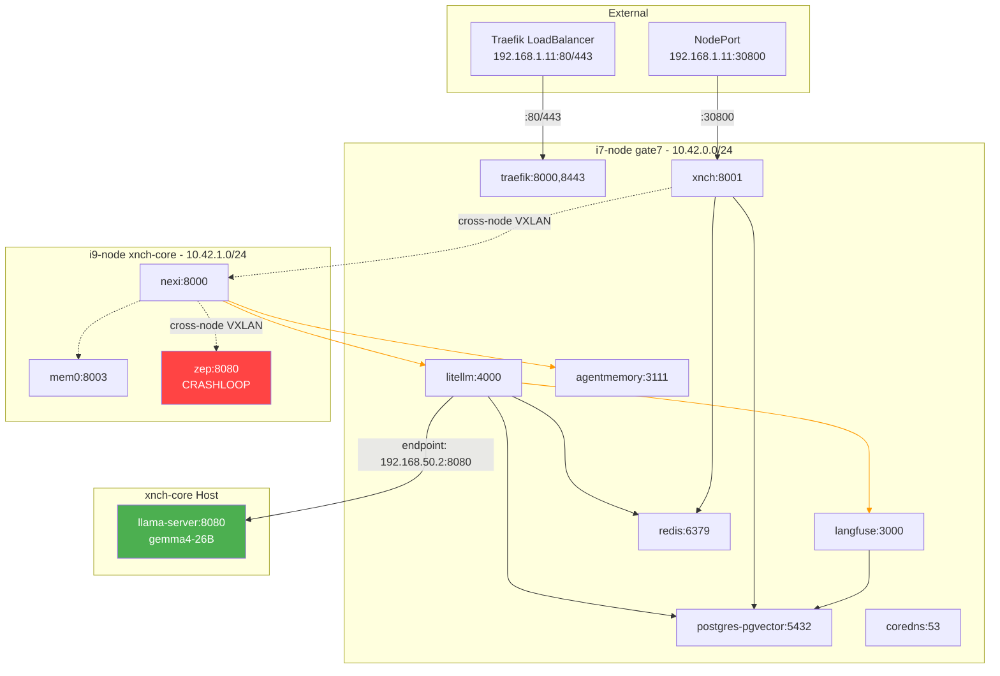

# Network Map — Live Cluster 2026-06-28

## Pod CIDR Allocation

| Node | Pod CIDR |
|------|----------|
| gate7 | `10.42.0.0/24` |
| xnch-core | `10.42.1.0/24` |

## Service CIDR: `10.43.0.0/16`

## Service Inventory

### xnch-system Services

| Service | Type | ClusterIP | Port(s) | Selector | Endpoints | Used By |
|---------|------|-----------|---------|----------|-----------|---------|
| **xnch** | NodePort | 10.43.100.18 | 8001:30800/TCP | app=xnch | 10.42.0.33:8001 (gate7) | nexi, litellm (inbound), external:30800 |
| **nexi** | ClusterIP | 10.43.151.104 | 8000/TCP | app=nexi | 10.42.1.63:8000 (xnch-core) | xnch (outbound) |
| **litellm** | ClusterIP | 10.43.15.158 | 4000/TCP | app=litellm | 10.42.0.44:4000 (gate7) | xnch, nexi |
| **langfuse** | ClusterIP | 10.43.31.250 | 3000/TCP | app=langfuse | 10.42.0.43:3000 (gate7) | litellm |
| **postgres-pgvector** | ClusterIP | 10.43.157.136 | 5432/TCP | app=postgres-pgvector | 10.42.0.31:5432 (gate7) | litellm, langfuse, xnch |
| **redis** | ClusterIP | 10.43.20.186 | 6379/TCP | app=redis | 10.42.0.29:6379 (gate7) | litellm |
| **agentmemory** | NodePort | 10.43.199.232 | 3111:31111/TCP, 3113:31113/TCP | app=agentmemory | 10.42.0.49:3111,3113 (gate7) | nexi |
| **mem0** | NodePort | 10.43.2.230 | 8003:30803/TCP | app=mem0 | 10.42.1.40:8003 (xnch-core) | nexi |
| **zep** | ClusterIP | 10.43.225.174 | 8080/TCP | app=zep | NONE (CrashLoopBackOff) | nexi |
| **vllm-gemma4** | ClusterIP | 10.43.237.186 | 8000→8080/TCP | **NO SELECTOR** | 192.168.50.2:8080 (xnch-core host) | litellm |

### kube-system Services

| Service | Type | ClusterIP | External-IP | Port(s) | Selector |
|---------|------|-----------|-------------|---------|----------|
| **traefik** | LoadBalancer | 10.43.88.244 | 192.168.1.11, 192.168.50.2 | 80:32693, 443:30194 | app.kubernetes.io/instance=traefik-kube-system, app.kubernetes.io/name=traefik |
| **kube-dns** | ClusterIP | 10.43.0.10 | — | 53/UDP, 53/TCP, 9153/TCP | k8s-app=kube-dns |
| **metrics-server** | ClusterIP | 10.43.205.86 | — | 443/TCP | k8s-app=metrics-server |

## Cross-Node Communication Paths

### Flannel (VXLAN Overlay)
- Backend type: vxlan
- gate7 VTEP MAC: `1e:17:50:5f:02:e7` (public-ip: 192.168.1.11)
- xnch-core VTEP MAC: `1a:8e:d2:5d:64:31` (public-ip: 192.168.50.2)
- Cross-node ping: 0.3ms (internal) to 42ms (external)

### Traffic Flows

```
External → LoadBalancer(192.168.1.11:80/443)
   → traefik (10.42.0.8:8000/8443)
   → [Currently no Ingress routes configured]

External → NodePort(192.168.1.11:30800)
   → xnch (10.42.0.33:8001)
   → nexi (10.43.151.104 → 10.42.1.63:8000)  [cross-node via VXLAN]
   → litellm (10.43.15.158 → 10.42.0.44:4000) [cross-node via VXLAN]
   → vllm-gemma4 (no selector → 192.168.50.2:8080 [hostNetwork])
   → postgres (10.43.157.136 → 10.42.0.31:5432) [cross-node via VXLAN]
   → redis (10.43.20.186 → 10.42.0.29:6379)
   → agentmemory (10.43.199.232 → 10.42.0.49:3111)
   → mem0 (10.43.2.230 → 10.42.1.40:8003) [cross-node]
```

## Key Observations

### vllm-gemma4 Service
- **CRITICAL**: Has no pod selector and points directly to `192.168.50.2:8080` (xnch-core host IP)
- This is an Endpoint object manually created to route to the host-level `llama-server` process
- llama-server runs as a systemd service (`gemma4-llama.service`) on xnch-core, NOT in Kubernetes
- Process: `llama-server` PID 58345, `/home/x-nch/llama-cpp-turboquant-gemma4/build/bin/llama-server`

### zep Service
- **DEGRADED**: Endpoints exist (10.42.1.49:8080) but pod is in CrashLoopBackOff
- Error: `store.type must be set` — missing configuration

### Cross-Node Latency
- VXLAN overlay: ~0.3ms
- External path (192.168.1.11 ↔ 192.168.50.2): 2.5-42ms

### Listener Ports on i7-node (gate7)
| Port | Process | Purpose |
|------|---------|---------|
| 22 | sshd | SSH access |
| 6443 | k3s server | Kubernetes API |
| 10250 | kubelet | kubelet API |
| 18789 | openclaw | OpenClaw agent service |

### Listener Ports on i9-node (xnch-core)
| Port | Process | Purpose |
|------|---------|---------|
| 22 | sshd | SSH access |
| 8080 | llama-server | LLM inference API |
| 10250 | kubelet | kubelet API |
| 6444 | k3s agent | k3s agent |

## Mermaid Call Graph


