# Architecture Diagram Suite

Mermaid diagrams derived from the live **no-k3s** codebase (Aug 2026).  
Node A = `192.168.50.1` (gate7/i7). Node B = `192.168.50.2` (xnch-core/i9).

---

## 1. System Architecture

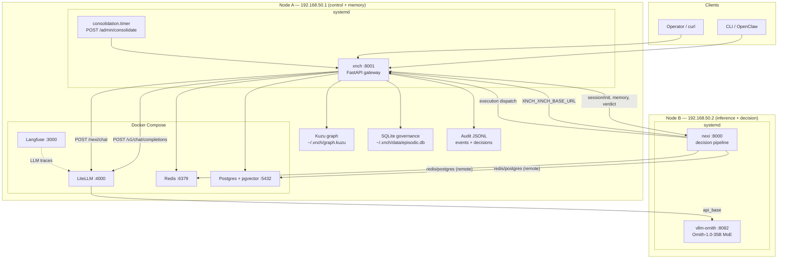

---

## 2. Infrastructure

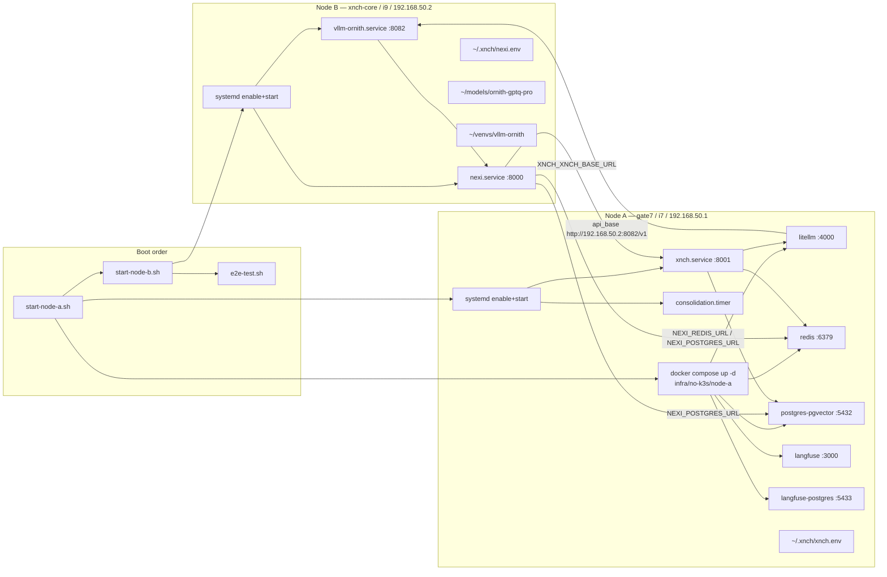

---

## 3. xnch (Control Plane)

```mermaid
flowchart TB
    subgraph API["FastAPI — xnch.main :8001"]
        HEALTH["GET /health"]
        STATE["GET /system/state"]

        SESS["/session/init<br/>/session/{id}/clarify"]
        MEM["/memory/read<br/>/memory/write"]
        VER["POST /verdict"]
        EXEC["/execution/execute<br/>/execution/outcome"]
        GOV["/governance/*<br/>/auth/public-key"]
        GW["/nexi/chat<br/>/nexi/memory/recall<br/>/nexi/system-prompt"]
        CHAT["POST /v1/chat/completions"]
        ADM["POST /admin/consolidate"]
    end

    subgraph Core["App state (lifespan)"]
        AUTH["Auth + GovernanceStore"]
        POL["PolicyEngine + PolicyLoader"]
        KV["KVCache (Redis)"]
        SB["SensoryBuffer L0"]
        WM["WorkingMemory L1"]
        PGE["PgEpisodicStore L2"]
        GS["GraphStore L3 Kuzu"]
        RS["RelationshipStore PG"]
        EP["EpisodicStore SQLite"]
        PAT["PatternStore SQLite"]
        LEARN["PatternExtractor<br/>ScoreAdapter<br/>PolicyCandidateGenerator"]
        LOG["EventLog + DecisionLedger"]
    end

    SESS --> AUTH
    SESS --> KV
    SESS -->|"forward"| NEXI_EXT["nexi :8000 /session/start"]

    MEM --> PGE
    MEM --> PAT
    MEM --> POL

    VER --> POL
    VER --> LOG
    VER --> EP
    VER --> PGE

    EXEC --> EP
    EXEC --> PGE
    EXEC -->|"callback"| NEXI_EXT

    GW --> WM
    GW --> PGE
    GW --> GS
    GW --> RS
    GW --> SB
    GW -->|"LiteLLM"| LLM_EXT["litellm :4000"]

    ADM --> CONS_JOB["jobs/consolidation.py"]
    CONS_JOB --> PGE
    CONS_JOB --> GS
    CONS_JOB --> RS

    LEARN --> PGE
    LEARN --> PAT
```

---

## 4. nexi (Decision Engine)

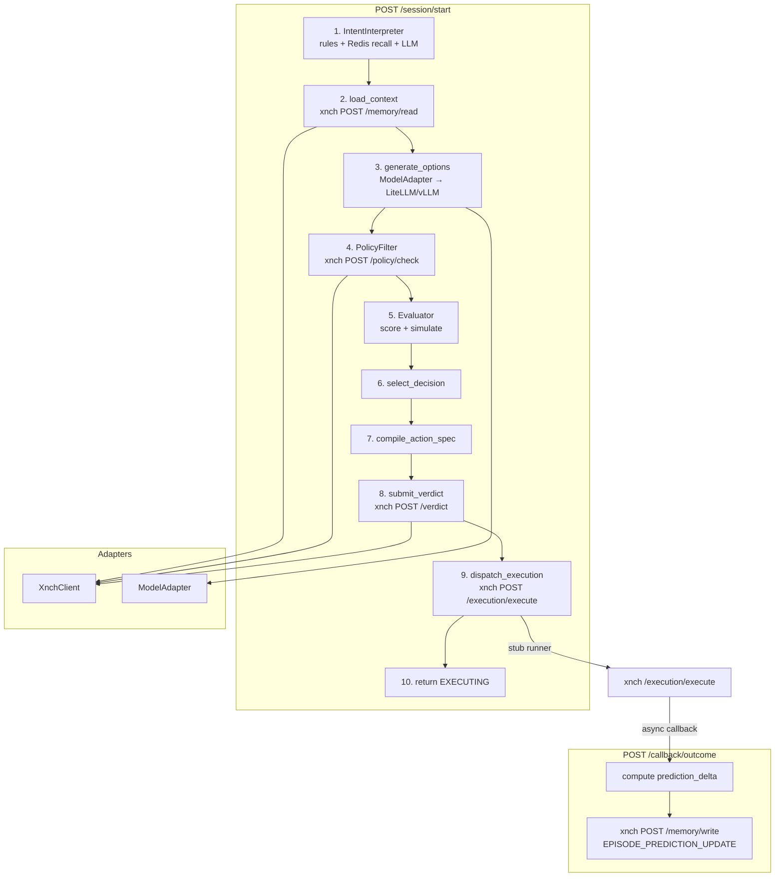

---

## 5. Memory Evolution

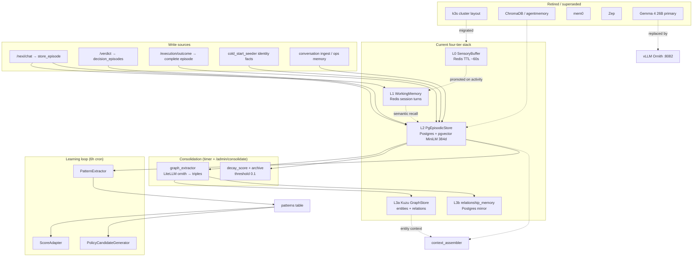

---

## 6. Schema

Eight tables across Postgres, Kuzu, and SQLite. Split into four diagrams so field labels stay fully visible in preview.

### 6a. Postgres L2 — episodic core

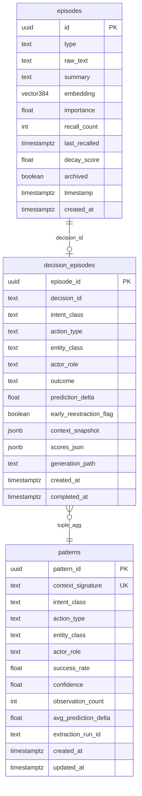

### 6b. Postgres — relationships and quarantine

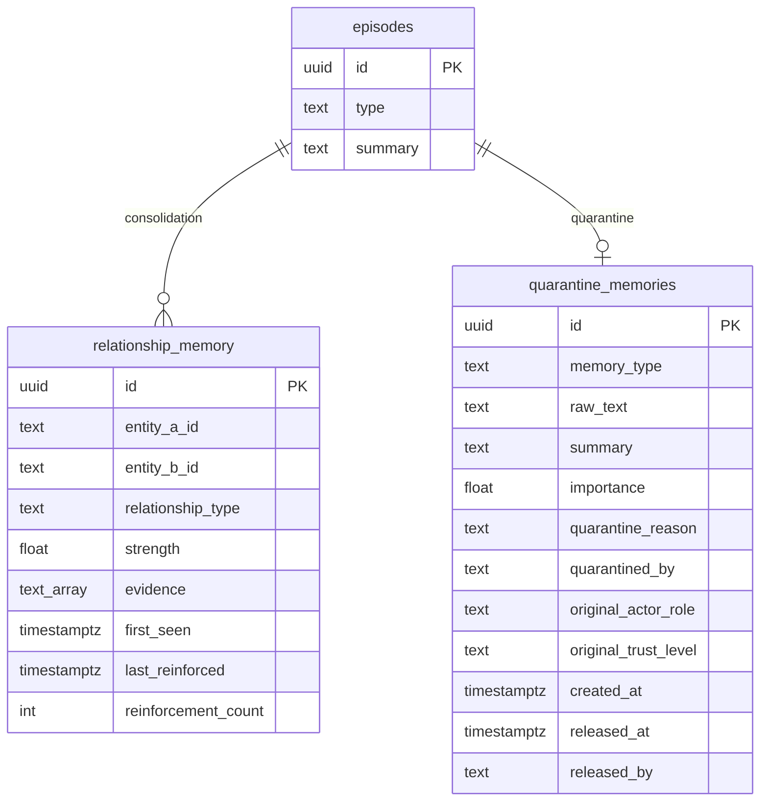

### 6c. Kuzu L3a — graph store

File: `~/.xnch/graph.kuzu`

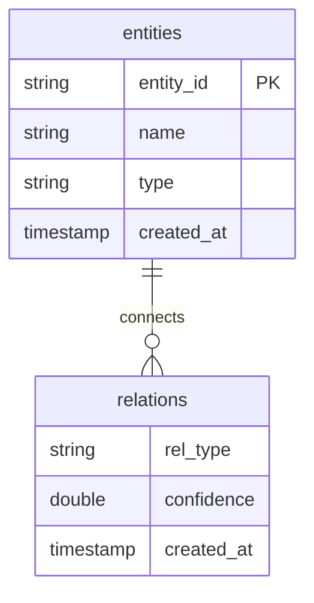

### 6d. SQLite — governance episodic

File: `~/.xnch/data/episodic.db` (verdict path; mirrors decision tuple)

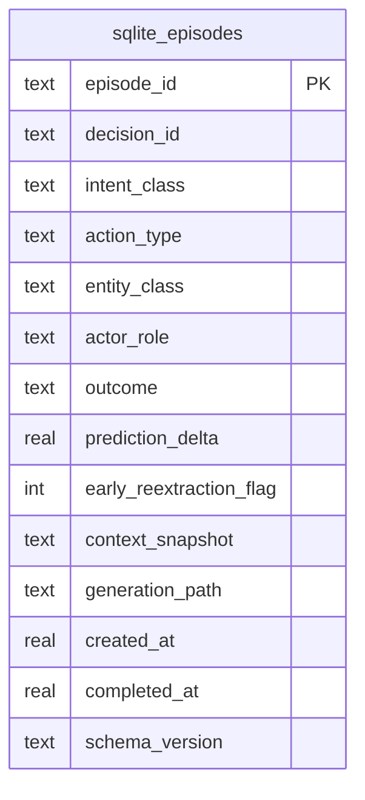

### Cross-store links

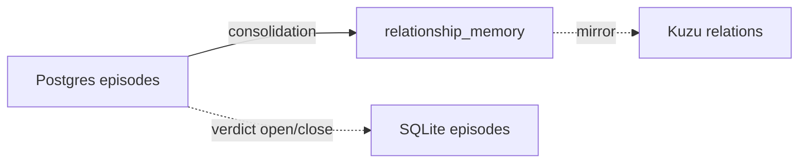

---

## 7. Read Sequence Path

Covers decision-loop read (`/memory/read`), chat recall (`/nexi/chat`), and direct recall (`/nexi/memory/recall`).

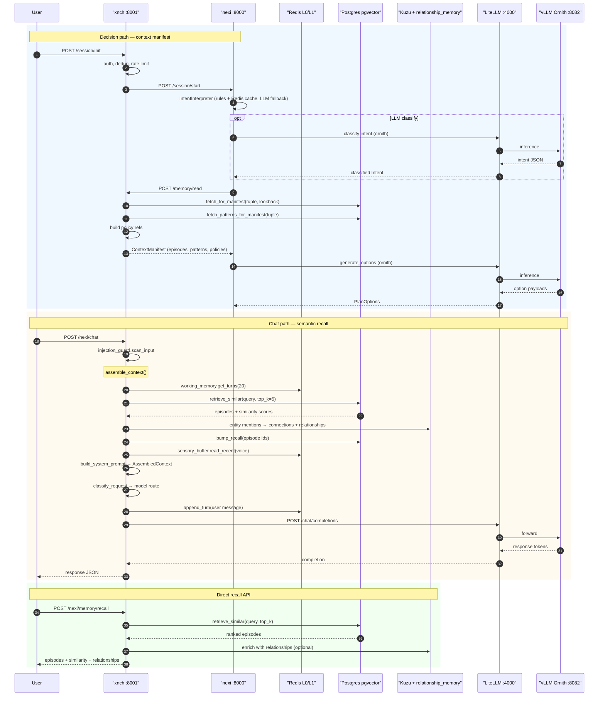

---

## 8. Write Sequence Path

Covers chat episodes, verdict decision episodes, execution outcomes, and learning writes.

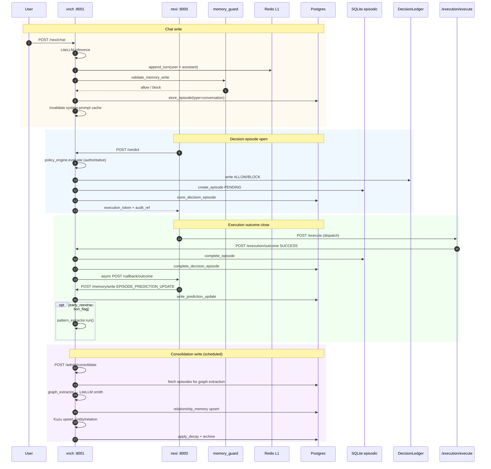

---

## Related files

| Path | Purpose |
|------|---------|
| `infra/no-k3s/node-a/start-node-a.sh` | Node A boot |
| `infra/no-k3s/node-b/start-node-b.sh` | Node B boot |
| `infra/no-k3s/e2e-test.sh` | Stack smoke test |
| `xnch/main.py` | Control plane composition |
| `nexi/main.py` | Decision pipeline steps 3–12 |
| `xnch/memory/pg_episodic_store.py` | L2 schema owner |
| `nexi/pipeline/context_assembler.py` | Chat read assembly |
