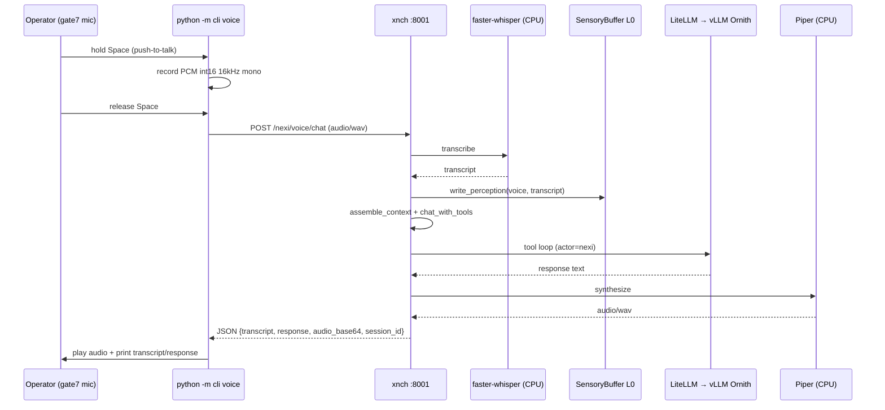
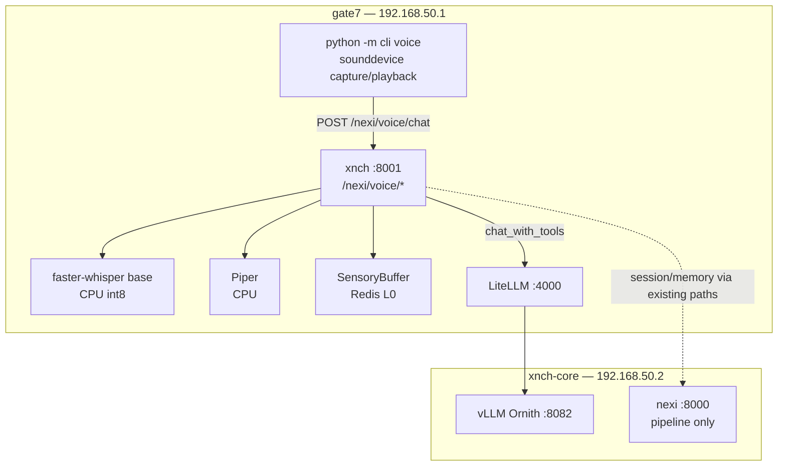

# Nexi Voice — Architecture (gate7 CLI, STT + TTS)

Architecture for **push-to-talk voice** on gate7: the existing `python -m cli`
client captures microphone audio, xnch transcribes and synthesizes speech, and
Nexi responds through the same `/nexi/chat` tool loop used for text.

**Scope (v1):** gate7-only CLI client, offline STT + TTS, full voice-in /
voice-out loop. Always-on ambient listening is explicitly out of scope (phase 2).

**Related docs:**
- [Architecture diagram suite](../architecture-suite.md) — no-k3s topology
- [MCP CLI reference](mcp-cli.md) — existing `python -m cli chat`
- [Mac voice client](nexi-voice-mac-client.md) — CLI + mic on MacBook, API on gate7
- [MCP HTTP API](../reference/mcp-http-api.md) — `/nexi/chat` contract
- Perception plan: `misc/fluffy-percolating-cosmos.md` (Phase 4)

---

## Goals

| Goal | Detail |
|------|--------|
| **Full loop** | Mic → STT → Nexi chat (MCP tools) → TTS → speaker |
| **Client** | `python -m cli voice` on gate7 (same venv / auth as text chat) |
| **Privacy** | No cloud STT/TTS; models run locally on gate7 CPU |
| **Parity** | Voice turns use the same memory, persona, and tool loop as text chat |
| **Latency target** | &lt; 3s STT + &lt; 8s first LLM token + &lt; 2s TTS for a short utterance |

---

## Non-goals (v1)

- Always-on VAD / ambient listening (phase 2)
- Speaker verification / enrollment (reuse prior parakeet work later)
- Mobile / OpenClaw / Telegram voice (future channel adapters)
- Streaming TTS during LLM generation (phase 2; v1 returns complete audio)
- GPU offload to node-b for Whisper (optional later; v1 is CPU on gate7)

---

## Current state vs target

### What exists

| Piece | Location | Gap |
|-------|----------|-----|
| `VoiceDaemon` | `xnch/perception/voice_daemon.py` | Silero VAD + faster-whisper; no HTTP route; `device="cuda"` wrong for gate7 |
| `SensoryBuffer` | `xnch/memory/sensory_buffer.py` | Works; voice payloads use `transcript` key |
| `context_assembler` | `nexi/pipeline/context_assembler.py` | Reads voice snippets but uses `data` key; **never injects into prompt** |
| `AttentionFilter` | `xnch/perception/attention_filter.py` | `forward_to_gateway` rule; no consumer |
| CLI text chat | `cli/main.py` `chat` | No audio capture/playback |
| TTS | — | **Not implemented** |

### Target (v1)



---

## Deployment topology

Voice inference stays on **gate7 (node-a)** — CPU only. LLM inference stays on
**node-b** via existing LiteLLM → vLLM path. No new services on node-b for v1.



### Why CPU on gate7

| Factor | Rationale |
|--------|-----------|
| gate7 has no GPU | `voice_daemon.py` today hardcodes `device="cuda"` — must change |
| Push-to-talk | No continuous inference; CPU `base` Whisper is ~1–2s for 5–10s utterance |
| Piper TTS | ~real-time on CPU for short replies; no VRAM contention with Ornith |
| node-b VRAM | 3090 reserved for Ornith MoE; adding Whisper risks OOM / latency spikes |

Optional **phase 1.5:** offload STT to node-b if gate7 CPU is too slow (separate
systemd unit, HTTP sidecar). Not required for MVP.

---

## Component design

### 1. Voice service layer (`xnch/voice/`)

New package — keeps perception daemons separate from request-path voice API.

```
xnch/voice/
├── __init__.py
├── stt.py          # faster-whisper wrapper (lazy model load)
├── tts.py          # Piper wrapper (lazy voice load)
├── audio.py        # PCM/WAV normalize, duration limits, format validation
└── pipeline.py     # transcribe → chat → synthesize orchestration
```

| Module | Responsibility |
|--------|----------------|
| `stt.py` | Load `WhisperModel(model, device="cpu", compute_type="int8")`; `transcribe(wav_bytes) → str` |
| `tts.py` | Load Piper ONNX + JSON config from `~/.xnch/voice/`; `synthesize(text) → wav_bytes` |
| `audio.py` | Validate sample rate (16 kHz), channels (mono), max duration (60s), max size (10 MB) |
| `pipeline.py` | Single entry: `voice_chat(app, audio, session_id, actor_role) → VoiceChatResult` |

**Model defaults (configurable via `XNCH_VOICE_*`):**

| Setting | Default | Notes |
|---------|---------|-------|
| STT model | `base` | `tiny` for speed, `small` for accuracy |
| STT language | `en` | Fixed for v1; skip auto-detect overhead |
| TTS engine | `piper` | Local ONNX |
| TTS voice | `en_US-lessac-medium` | Bundled Piper voice; override in config |
| Max audio duration | `60s` | Reject longer recordings |
| Max response TTS length | `2000` chars | Truncate with ellipsis before synthesis |

Refactor existing `VoiceDaemon._transcribe()` logic into `stt.py` (int16 → float32
normalization is already correct in current tree).

### 2. HTTP API (`xnch/routes/nexi_gateway.py` or `xnch/routes/voice.py`)

New routes under `/nexi/voice` (same trust model as `/nexi/chat`).

#### `POST /nexi/voice/transcribe`

Transcribe only. Useful for debugging and CLI `voice listen`.

| Field | Type | Required |
|-------|------|----------|
| `audio` | `multipart file` (WAV or raw PCM) | yes |
| `format` | `wav` \| `pcm_s16le` | no (default `wav`) |
| `sample_rate` | int | no (default 16000; required for PCM) |

**Response:**
```json
{
  "transcript": "what's the status of vllm on node-b",
  "duration_s": 3.2,
  "language": "en"
}
```

#### `POST /nexi/voice/speak`

TTS only. Useful for testing Piper and replaying last response.

| Field | Type | Required |
|-------|------|----------|
| `text` | string | yes |
| `voice` | string | no |

**Response:** `audio/wav` stream, or JSON with `audio_base64` when `Accept: application/json`.

#### `POST /nexi/voice/chat` (primary endpoint)

Full loop: STT → chat → TTS.

| Field | Type | Required |
|-------|------|----------|
| `audio` | multipart file | yes |
| `session_id` | string | yes |
| `actor_role` | string | no (default `operator`) |
| `return_audio` | bool | no (default true) |

**Response:**
```json
{
  "transcript": "check nexi health",
  "response": "vLLM Ornith is up on node-b :8082 ...",
  "session_id": "sess-abc",
  "model_used": "nexi-ornith",
  "audio_base64": "<wav bytes>",
  "audio_format": "wav",
  "sample_rate": 22050
}
```

**Internal flow:**
1. `scan_input(transcript)` — injection guard on text, not raw audio
2. `sensory_buffer.write_perception("voice", transcript)` — unified schema
3. `assemble_context(...)` — includes voice in system prompt (see below)
4. `chat_with_tools(app, messages, model, actor_role="nexi")` — same as text chat
5. `tts.synthesize(response)` — if `return_audio`
6. Memory write — same episodic rules as `/nexi/chat` (dedup, guard)
7. `_invalidate_system_prompt_cache()` — same as text chat

#### Error codes

| Status | When |
|--------|------|
| `400` | Bad audio format, empty transcript, injection guard |
| `413` | Audio too large / too long |
| `502` | STT/TTS model failure or LiteLLM unavailable |
| `503` | Voice subsystem disabled (`XNCH_VOICE_ENABLED=false`) |

### 3. Sensory buffer schema fix

Standardize on `SensoryBuffer.write_perception()` for all voice writes. Deprecate
direct Redis writes from `VoiceDaemon`.

```json
{
  "source": "voice",
  "data": "transcribed text here",
  "timestamp": 1710000000.0,
  "meta": {
    "duration_s": 3.2,
    "session_id": "sess-abc"
  }
}
```

`context_assembler` change — read `data` (with fallback to legacy `transcript`):

```python
snippet = p.get("data") or p.get("transcript") or ""
```

Append to system prompt when non-empty:

```
## Recent voice
- [12:04 UTC] what's the status of vllm
```

### 4. Persona / capabilities

Add to `nexi/character/capabilities.yaml`:

```yaml
voice:
  mode: push_to_talk
  client: python -m cli voice (gate7)
  stt: faster-whisper/base/cpu
  tts: piper/en_US-lessac-medium
  endpoints:
    - POST /nexi/voice/chat
    - POST /nexi/voice/transcribe
    - POST /nexi/voice/speak
```

No change to lean chat prompt size — voice config lives in capabilities JSON only.

### 5. CLI (`cli/voice.py`)

New Typer subcommand group: `python -m cli voice`.

```
python -m cli voice talk              # push-to-talk REPL (default)
python -m cli voice talk --once       # single utterance then exit
python -m cli voice listen            # STT only, print transcript
python -m cli voice speak "hello"     # TTS only, play audio
python -m cli voice devices           # list sounddevice inputs/outputs
```

#### `voice talk` UX (push-to-talk)

```
$ python -m cli voice talk
Nexi voice (gate7) — hold Space to talk, release to send, /quit to exit
session: sess-7f3a...

[Space held] ● recording...
[released]   transcribing...
you> what's running on node-b?
nexi> vLLM Ornith is healthy on :8082. Nexi engine is on :8000.
🔊 playing response (4.2s)
```

| Key | Action |
|-----|--------|
| `Space` (hold) | Record while held |
| `Space` (tap) | Toggle record (accessibility alt) |
| `Ctrl+C` / `/quit` | Exit |
| `/text hello` | Fallback to text chat for one turn |
| `/mute` | STT only, print response text (no TTS playback) |

#### CLI dependencies (gate7)

| Package | Purpose |
|---------|---------|
| `sounddevice` | Mic capture + speaker playback |
| `numpy` | PCM buffer handling |
| `scipy` or stdlib `wave` | WAV packaging before upload |

Optional: `keyboard` or `pynput` for global Space hook (v1 can use terminal
`readchar` — operator must keep terminal focused).

#### CLI → API

```python
# cli/client.py additions
def voice_chat(self, wav_bytes: bytes, *, session_id: str) -> dict: ...
def voice_transcribe(self, wav_bytes: bytes) -> dict: ...
def voice_speak(self, text: str) -> bytes: ...
```

Upload as `multipart/form-data` with fields `audio`, `session_id`.

#### CLI config (`cli/config.py`)

| Var | Default | Meaning |
|-----|---------|---------|
| `XNCH_VOICE_INPUT_DEVICE` | system default | sounddevice input index/name |
| `XNCH_VOICE_OUTPUT_DEVICE` | system default | sounddevice output index/name |
| `XNCH_VOICE_SAMPLE_RATE` | `16000` | Capture rate for STT |
| `XNCH_VOICE_PTT_KEY` | `space` | Push-to-talk key |
| `XNCH_VOICE_MUTE` | `false` | Skip TTS playback |

---

## Security and trust

| Control | Implementation |
|---------|----------------|
| Actor role | Same as text chat (`operator` default); `X-Actor-Role` header |
| Injection guard | Run `scan_input()` on **transcript** before chat |
| Memory guard | Same `validate_memory_write()` as `/nexi/chat` |
| Audio size cap | 10 MB / 60s — reject before STT |
| Empty transcript | Return `400` — do not call LLM on silence/noise |
| Trust level | No new capability flag for v1; voice routes mirror `/nexi/chat` |
| Audit | Emit `VOICE_CHAT_START`, `VOICE_STT_DONE`, `VOICE_TTS_DONE` events |

Voice does **not** bypass MCP tool policy. Actor `nexi` in the tool loop is unchanged.

---

## Configuration (`xnch/config.py`)

```python
# Voice (v1)
voice_enabled: bool = True
voice_stt_model: str = "base"
voice_stt_device: str = "cpu"
voice_stt_compute_type: str = "int8"
voice_stt_language: str = "en"
voice_tts_engine: str = "piper"
voice_tts_voice_path: Path = Path("~/.xnch/voice/en_US-lessac-medium.onnx")
voice_tts_config_path: Path = Path("~/.xnch/voice/en_US-lessac-medium.onnx.json")
voice_max_audio_duration_s: float = 60.0
voice_max_audio_bytes: int = 10_485_760
voice_max_tts_chars: int = 2000
voice_models_dir: Path = Path("~/.xnch/voice/models")
```

Env prefix: `XNCH_VOICE_*` (e.g. `XNCH_VOICE_STT_MODEL=small`).

---

## Model provisioning (gate7)

Directory layout:

```
~/.xnch/voice/
├── models/
│   └── whisper/          # faster-whisper cache (auto-download)
├── en_US-lessac-medium.onnx
├── en_US-lessac-medium.onnx.json
└── voices.json           # optional manifest
```

**Install script** (new: `scripts/install-voice-models.sh`):

1. `pip install faster-whisper piper-tts` (or `piper-onnx` runtime)
2. Download Piper voice from rhasspy/piper releases
3. Warm-load Whisper `base` on first `xnch` start (optional lazy load)

**systemd:** no separate unit for v1 — models load inside xnch process on first
voice request. Optional `ExecStartPre` warm-up in future.

---

## Observability

| Signal | Where |
|--------|-------|
| STT latency | Langfuse span `voice.stt` |
| TTS latency | Langfuse span `voice.tts` |
| Chat latency | Existing `chat_with_tools` trace |
| Transcript + response | Episodic store (same as text chat) |
| Metrics | Prometheus counters: `xnch_voice_requests_total`, `xnch_voice_stt_seconds` |

---

## Implementation phases

### Phase 1 — API + fixes (no CLI)

1. `xnch/voice/` package (stt, tts, audio, pipeline)
2. `/nexi/voice/transcribe`, `/speak`, `/chat` routes
3. Fix `context_assembler` voice injection + schema fallback
4. Config + `capabilities.yaml` voice section
5. Tests with mocked STT/TTS (no mic/GPU in CI)

### Phase 2 — CLI

1. `cli/voice.py` + `client.voice_*` methods
2. `python -m cli voice talk` push-to-talk REPL
3. `voice devices`, `voice listen`, `voice speak` utilities
4. Docs: runbook `docs/runbooks/voice-deploy.md`

### Phase 3 — Polish

1. Lazy model preload on xnch startup (config flag)
2. Terminal bell / visual indicator during record
3. `--mute` and `--text` fallback flags
4. Update `architecture-suite.md` diagram with voice path

### Phase 4 — Future (out of v1 scope)

- Always-on VAD daemon (`VoiceDaemon` continuous loop)
- Speaker verification (ECAPA / parakeet enrollment)
- Streaming TTS (sentence-chunked playback while LLM streams)
- node-b GPU STT sidecar if CPU too slow
- WebSocket `/nexi/voice/stream` for lower latency

---

## Testing strategy

| Layer | Approach |
|-------|----------|
| Unit | `audio.py` validation; mock Whisper/Piper |
| API | `httpx.AsyncClient` + fixture WAV files in `tests/fixtures/voice/` |
| CLI | Mock `sounddevice`; assert multipart upload shape |
| E2E (manual) | `voice talk --once` on gate7 with USB mic |
| CI | No real audio hardware; no model downloads in default pytest |

Fixture audio: generate 1s 16kHz sine WAV in test setup; mock STT to return
fixed transcript.

---

## Open decisions

| # | Question | Recommendation |
|---|----------|----------------|
| 1 | Piper vs Coqui for v1? | **Piper** — offline, fast CPU, no training pipeline |
| 2 | WAV upload vs raw PCM? | **WAV** default; accept PCM for CLI efficiency later |
| 3 | TTS sample rate? | **22050 Hz** (Piper default); CLI resamples if needed |
| 4 | Separate `voice.py` router vs inline in `nexi_gateway.py`? | **`xnch/routes/voice.py`** — keeps gateway file size down |
| 5 | Warm-load models at xnch startup? | **Lazy** for v1; add `XNCH_VOICE_PRELOAD=true` in phase 3 |

---

## Files to create / modify

| Action | Path |
|--------|------|
| **Create** | `xnch/voice/stt.py`, `tts.py`, `audio.py`, `pipeline.py` |
| **Create** | `xnch/routes/voice.py` |
| **Create** | `cli/voice.py` |
| **Create** | `tests/test_voice_api.py`, `tests/fixtures/voice/` |
| **Create** | `scripts/install-voice-models.sh` |
| **Create** | `docs/runbooks/voice-deploy.md` |
| **Modify** | `xnch/main.py` — register voice router, optional lifespan preload |
| **Modify** | `xnch/config.py` — voice settings |
| **Modify** | `nexi/pipeline/context_assembler.py` — inject voice snippets |
| **Modify** | `nexi/character/capabilities.yaml` — voice section |
| **Modify** | `cli/main.py` — `app.add_typer(voice_app, name="voice")` |
| **Modify** | `cli/client.py` — voice HTTP methods |
| **Deprecate** | Direct Redis writes in `voice_daemon.py` — route through `SensoryBuffer` |
| **Update** | `docs/reference/mcp-http-api.md` — voice endpoints section |
| **Update** | `docs/architecture-suite.md` — voice in diagram |

---

## Summary

Voice on Nexi is a **thin layer** over existing chat: gate7 CLI captures audio,
xnch transcribes with CPU Whisper, runs the standard `chat_with_tools` path, and
synthesizes a Piper reply. No new inference stack on node-b; no change to Nexi's
decision pipeline on `:8000`. The main engineering work is the `xnch/voice`
package, three HTTP routes, sensory-buffer schema alignment, context injection,
and a `python -m cli voice talk` push-to-talk client.
