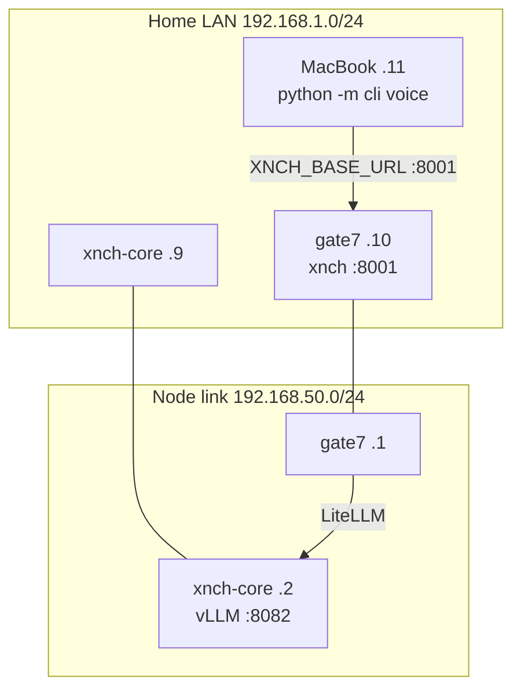
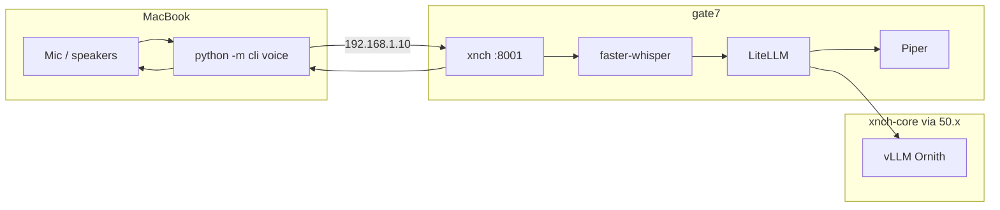

# Nexi Voice — Mac Client Setup

Run **voice + CLI on your MacBook** (mic/speaker local). **STT, TTS, LLM, and MCP
tools stay on gate7** (`xnch :8001`). The Mac only captures audio, calls HTTP
APIs, and plays the WAV reply.

## Network topology

All three machines sit on the **same home LAN** (e.g. `192.168.1.0/24`). The
`192.168.50.0/24` subnet is a **direct link between the two nodes only** — Mac
does not use it for the voice CLI.

| Host | Home LAN (operator) | Node link (gate7 ↔ xnch-core) |
|------|-------------------|-------------------------------|
| **MacBook** | `192.168.1.11` | — |
| **gate7** (node-a) | `192.168.1.10` | `192.168.50.1` |
| **xnch-core** (node-b) | `192.168.1.9` | `192.168.50.2` |



**Mac `XNCH_BASE_URL`:** use gate7 on the **home LAN**, not the node link:

```bash
export XNCH_BASE_URL=http://192.168.1.10:8001
```

You do **not** need `192.168.50.2` on the Mac for voice — gate7 proxies chat to
node-b over the `50.x` link internally.



**Related:** [voice architecture](nexi-voice-architecture.md) · [gate7 deploy](../runbooks/voice-deploy.md) · [test scenarios](nexi-voice-test-scenarios.md)

---

## Prerequisites

| Requirement | Notes |
|-------------|--------|
| **Network** | Mac must reach gate7 on the **home LAN** (e.g. `http://192.168.1.10:8001`). The `192.168.50.x` link is gate7↔xnch-core only. |
| **gate7 voice** | Already deployed — see [voice-deploy runbook](../runbooks/voice-deploy.md) |
| **Python 3.13+** | `brew install python@3.13` or [python.org](https://www.python.org/) |
| **PortAudio** | `brew install portaudio` (required by `sounddevice`) |
| **uv** (recommended) | `brew install uv` |

The Mac does **not** need Piper, Whisper, or GPU. Models run on gate7 only.

---

## 1. Clone and install (Mac)

```bash
git clone --recursive https://github.com/x-nch/xnchSystems.git
cd xnchSystems
git checkout v0.1          # or branch with voice client docs
git pull
git submodule update --init --recursive

# Repo venv — Mac voice client only (no full monorepo editable install)
uv venv --python 3.13 .venv
source .venv/bin/activate
uv pip install -r requirements-mac-voice-client.txt
export PYTHONPATH="$PWD:$PWD/xnch"
```

`pip install -e .` on the repo root is for gate7/full dev; on Mac use
`requirements-mac-voice-client.txt` instead (avoids setuptools multi-package error).

If `uv sync` is preferred on gate7:

```bash
uv sync --group voice-client
source .venv/bin/activate
```

---

## 2. Environment (`~/.xnch/xnch.env` on Mac)

Create `~/.xnch/xnch.env` (copy auth secret from gate7 if you use JWT):

```bash
# Point CLI at gate7 on the home LAN (not 192.168.50.1)
export XNCH_BASE_URL=http://192.168.1.10:8001
export XNCH_ACTOR=operator

# Copy from gate7 ~/.xnch/xnch.env (same secret as xnch.service)
export XNCH_AUTH_SECRET='your-shared-secret-here'

# Optional — only if you run nexi health checks from Mac (usually not needed for voice)
# export NEXI_BASE_URL=http://192.168.1.9:8000

# Voice I/O (Mac — usually leave output device unset; CoreAudio default is fine)
# export XNCH_VOICE_INPUT_DEVICE=0
# export XNCH_VOICE_OUTPUT_DEVICE=0
export XNCH_VOICE_SAMPLE_RATE=16000
```

Load before each session:

```bash
cd ~/xnchSystems
source .venv/bin/activate
export PYTHONPATH="$PWD:$PWD/xnch"
set -a && source ~/.xnch/xnch.env && set +a
```

---

## 3. Verify connectivity

```bash
cd ~/xnchSystems   # or your clone path
source .venv/bin/activate
set -a && source ~/.xnch/xnch.env && set +a

curl -sf "$XNCH_BASE_URL/health"
python -m cli voice devices
python -m cli voice speak "Mac client online"
```

**Expect:** health 200, Mac mic/speaker listed, audible TTS from gate7-synthesized audio.

---

## 4. Voice chat

```bash
python -m cli voice talk --once    # one round trip
python -m cli voice talk           # REPL — Enter to record, /quit to exit
python -m cli voice listen -s 5    # STT only
```

Each `voice talk` launch starts a **fresh session** unless you pass `--continue`.

---

## 5. macOS audio tips

| Task | Command |
|------|---------|
| List devices | `python -m cli voice devices` |
| Pick input | `export XNCH_VOICE_INPUT_DEVICE=<index>` |
| Pick output (AirPods, etc.) | `export XNCH_VOICE_OUTPUT_DEVICE=<index>` |
| Mute playback (debug) | `export XNCH_VOICE_MUTE=1` |

System Settings → Sound: confirm the correct mic and output before `voice talk`.

Playback resamples Piper's 22050 Hz automatically when using a hardware device index.

---

## 6. Troubleshooting

| Symptom | Fix |
|---------|-----|
| `Connection refused` to `:8001` | On Mac: `ping 192.168.1.10` (home LAN IP, not `50.1`); `systemctl status xnch` on gate7 |
| `403` / auth errors | Set `XNCH_AUTH_SECRET` to match gate7 |
| `503 Voice subsystem disabled` | On gate7: `XNCH_VOICE_ENABLED=true` in `xnch.env`, restart `xnch.service` |
| `PortAudio` / `sounddevice` error | `brew install portaudio`, reinstall: `uv pip install --force-reinstall sounddevice` |
| No mic permission | System Settings → Privacy → Microphone → allow Terminal/iTerm/Cursor |
| Slow first reply | First Whisper load on gate7 (~10–30s); later turns faster |
| Same reply every turn | Don't use `--continue` with a stale session; restart `voice talk` |

---

## 7. Agent handoff (paste into Mac Cursor)

Use this block when opening the repo on the MacBook:

```text
Goal: Run Nexi voice CLI locally on macOS; backend is gate7 xnch API.

Repo: xnchSystems (branch v0.1 or latest with voice client docs)
Doc: docs/guides/nexi-voice-mac-client.md

Setup checklist:
1. brew install python@3.13 portaudio uv
2. git clone --recursive; uv venv; uv pip install -e . sounddevice numpy
3. ~/.xnch/xnch.env with XNCH_BASE_URL=http://192.168.1.10:8001 and XNCH_AUTH_SECRET from gate7
4. curl $XNCH_BASE_URL/health
5. python -m cli voice devices
6. python -m cli voice speak "test"
7. python -m cli voice talk --once

Do NOT install Piper/Whisper on Mac — STT/TTS run on gate7 only.
Gate7 voice deploy runbook: docs/runbooks/voice-deploy.md
```

---

## Architecture note

| Component | Where |
|-----------|--------|
| Mic capture / speaker playback | **Mac** (`cli/voice_io.py`, sounddevice) |
| STT (faster-whisper) | **gate7** |
| TTS (Piper) | **gate7** |
| LLM + MCP tools | **gate7** → LiteLLM → **node-b** Ornith |

Latency includes one HTTP round trip per turn (audio up, JSON+audio down). Typical
warm path: 5–20s depending on utterance length and LLM.
