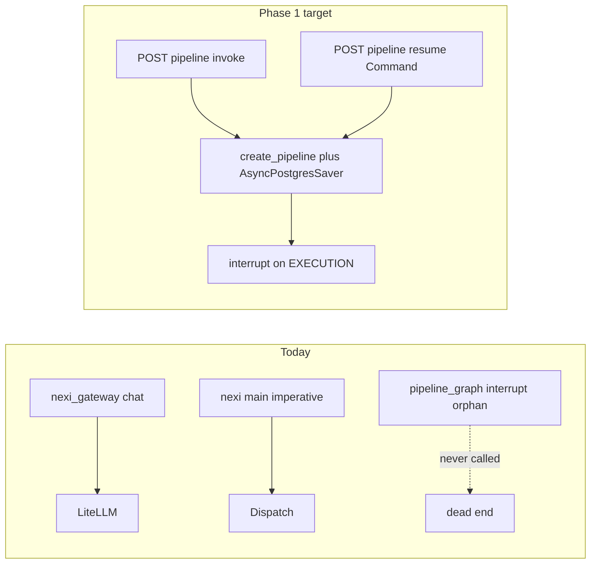

# Loop Engineering Roadmap

Source: [loop-engineering-and-evolutionary-optimization.md](./loop-engineering-and-evolutionary-optimization.md)  
Saved: 2026-08-14  
Status: Phase 0+1 ready to execute; Phases 2–4 deferred

Verified against tree: research claims mostly hold, with one critical correction that changes Phase 1.

## Correction vs research action #1

`create_pipeline` in `xnch/agents/pipeline_graph.py` accepts `checkpointer` and calls `interrupt()` on EXECUTION — but **nothing imports or invokes it**. Live paths today:

- Chat: `xnch/routes/nexi_gateway.py` → context + LiteLLM (no decision graph)
- Decisions: `nexi/main.py` imperative pipeline (`PolicyFilter` → `Evaluator` → `select_decision` → compile → dispatch) — **no** `interrupt()`
- Parallel HITL: beeAI `AskPermissionRequirement` (feature-flagged)

So “wire checkpointer at the call site” is incomplete: there is no call site. Phase 1 must **hang the graph into xnch**, then resume.

## Locked decisions

| Decision | Choice |
|---|---|
| Loop-4 signal | Episodic PG canonical; Langfuse diagnostics-only |
| deepagents package | Do **not** re-add; borrow patterns later |
| OpenEvolve on vLLM flags | Skip; scripted sweep only |
| optillm memory plugin / AutoThink / deepconf | Skip |
| Persona evolution target | qwen-vl-7B first (production resident); ornith only if fitness plateaus in unit-swap windows |
| Learning LLM pin | Resident model via config (default `qwen2.5-vl-7b`), not hardcoded `ornith` |

---

## Phase 0 — Unbreak existing loop-4 (same PR as Phase 1 start)

Cheapest fix; stops silent no-ops while qwen-vl is resident (`Conflicts=vllm-ornith.service`).

- Add `learning_model: str = "qwen2.5-vl-7b"` to `xnch/config.py` (`XNCH_LEARNING_MODEL`)
- Replace `_LLM_MODEL = "ornith"` in `xnch/learning/policy_candidates.py` with `settings.learning_model`
- Align `beeai_model` default in `xnch/config.py` if still `ornith`

---

## Phase 1 — Live, checkpointed HITL gate (highest leverage)

**Goal:** demo approve/reject of an EXECUTION interrupt end-to-end.

1. **Runtime owner** — new thin module e.g. `xnch/agents/pipeline_runtime.py`:
   - `AsyncPostgresSaver.from_conn_string(settings.postgres_url)` (dep already in `pyproject.toml`)
   - `await setup()` / teardown in lifespan
   - `create_pipeline(checkpointer=saver)` singleton on `app.state`

2. **Lifespan** — wire in `xnch/main.py` lifespan next to existing PG stores

3. **Routes** (governance-adjacent; reuse auth patterns from `xnch/routes/governance.py`):
   - `POST /governance/pipeline/invoke` — `{session_id, raw_input, thread_id?}` → `ainvoke`/`aget_state` with `configurable.thread_id`; if interrupted, return pending payload (`approve_execution` + selected option)
   - `POST /governance/pipeline/resume` — `{thread_id, approved: bool}` → `Command(resume=approved)` and continue to compile/dispatch or END

4. **Interrupt contract** — keep current falsy/truthy resume in `pipeline_graph.py` `select()` for v1; typed `approve|reject` can follow

5. **Do not** replace `nexi/main.py` yet — keep imperative path as production default; graph path is explicit and demoable. Optional later: `XNCH_LANGGRAPH_PIPELINE` flag to route EXECUTION through the graph

6. **Tests** — in-memory `MemorySaver` in unit tests: EXECUTION → interrupt → resume true → compile path; resume false → END

---

## Phase 2 — Loop 2 eval harness (prerequisite for OpenEvolve)

**Goal:** frozen fitness signal for outputs (not option scoring).

- New package area e.g. `nexi/eval/` or `scripts/eval_harness/`:
  - Frozen prompt set (YAML/JSON cases)
  - Deterministic graders first (schema, forbidden substrings, required tool mentions)
  - Optional LLM-judge via LiteLLM resident model
  - Persist scores into episodic PG (extend episode metadata or small `eval_runs` table)
- Leave `nexi/pipeline/evaluator.py` as pre-selection option scoring — different concern
- Document: episodic store = loop-4 signal

---

## Phase 3 — Ops / inference (Node B; after Phase 1–2 code is stable)

- **vLLM sweep**: scripted restart/measure of remaining flags on `vllm-ornith.service`; baseline already `0.95 / seqs 2 / max-model-len 32768` — do not use OpenEvolve
- **optillm hard-reasoning mode**: `latest-proxy` → `:8082`, one `ornith-reasoned` block in `xnch/litellm_config.yaml`, unit-swap wrapper + one classifier/override branch (not always-on; respects `Conflicts=`)
- **OpenEvolve trial**: offline CLI only (not a runtime dep), 20–50 iters on `nexi/character/persona.yaml`, evaluator = Phase 2 harness, target model qwen-vl-7B

---

## Phase 4 — Pattern borrow + vocabulary (docs / small code)

- Document deepagents borrow list: `when`-predicates on interrupt, todo-state shape, CompositeBackend-style draft→worktree apply for future codegen — **no** `deepagents` package
- Interview one-liner: checkpointed hard interrupt at loop-1 actuation boundary, default-deny, resumable; loop-4 harness changes gated through governance

---

## Out of scope

- Re-adopting `deepagents`
- Langfuse read-path for hill-climbing
- Building `codegen_loop.py` / worktrees (composition specified in Phase 4 only)
- Concurrent ornith + qwen-vl (hardware/unit conflict)

## First execute slice

**Phase 0 + Phase 1 only** (policy pin + live checkpointer/resume demo path + tests). Phases 2–4 wait for a follow-up.

### Execution: Cursor assigns → OpenCode via [opencode-mcp](https://github.com/AlaeddineMessadi/opencode-mcp)

Primary path (Cursor MCP → OpenCode headless API):

1. Setup once: `.cursor/mcp.json` with `npx -y opencode-mcp`; `"permission": "allow"` in `opencode.jsonc` for headless; Zen auth via Connect / `OPENCODE_API_KEY` (never commit).
2. `opencode_setup` → `opencode_fire` or `opencode_run` with `directory=/Users/xnch/xnchSystems`, `agent=build`, `providerID=opencode-go`, `modelID=kimi-k2.7-code` (Go subscription — not Zen `opencode/gpt-5.3-codex`), prompt from `research/opencode-handoff-loop-engineering.md`.
3. Monitor: `opencode_check` / `opencode_wait`; review: `opencode_review_changes`.

Fallbacks: CLI `opencode run -m opencode-go/kimi-k2.7-code`, or ACP (`opencode acp`) in Zed/JetBrains.

### Todos

1. `phase0-policy-pin` — Add `XNCH_LEARNING_MODEL`; unhardcode `policy_candidates` (align `beeai_model` default) to resident qwen-vl
2. `phase1-checkpointer-runtime` — `pipeline_runtime` + `AsyncPostgresSaver` in xnch lifespan; `create_pipeline(checkpointer=...)`
3. `phase1-invoke-resume-routes` — `POST /governance/pipeline/invoke` + `/resume` with `Command(resume=...)`; MemorySaver tests
4. `phase2-eval-harness` — Frozen eval set + graders; scores into episodic PG; document signal-source decision
5. `phase3-ops` — vLLM sweep; optillm ornith-reasoned mode; OpenEvolve persona trial
6. `phase4-patterns-docs` — Borrow patterns notes; interview HITL vocabulary; no deepagents package
